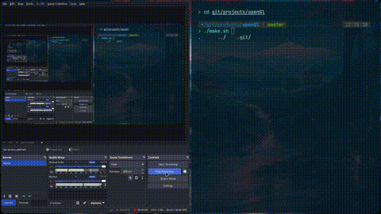

TODO:
1. Trying to write an own Rendering Engine.
2. Convert it to an Own Game Engine.
3. Drink Wine and smoke a cigarette on what I accomplished <3

## Dependencies

This project requires the following libraries to be installed on your system:

- GLFW (window/context/input handling)
- cglm (math library, header-only)
- OpenGL (usually provided by your GPU driver)

### Installing dependencies

**Arch:**
    sudo pacman -S glfw cglm

**Debian / Ubuntu:**
    sudo apt install libglfw3-dev libcglm-dev

**NixOS:**
    nix-shell -p glfw cglm pkg-config gcc

**macOS (Homebrew):**
    brew install glfw cglm

### Building
    chmod +x make.sh
    ./make.sh
